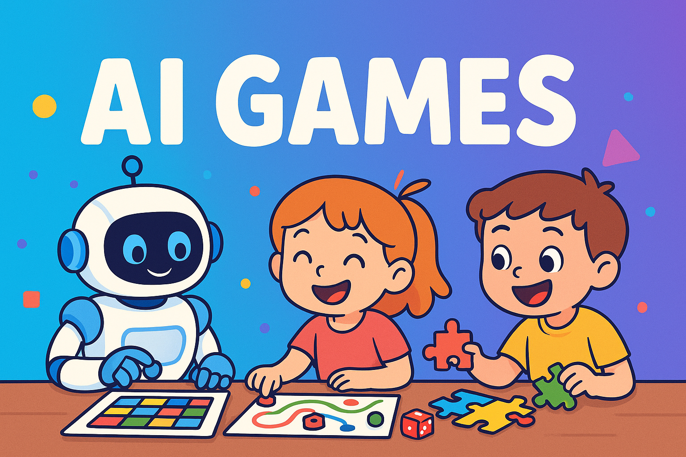

# 🤖 AI Games



Una colección de juegos interactivos desarrollados con React y potenciados por Inteligencia Artificial, diseñados para ofrecer una experiencia de juego única y adaptativa.

## 🎯 Características

- 🎲 Colección de juegos interactivos con IA
- 🔍 Sistema de búsqueda y filtrado por categorías
- 📱 Diseño responsive para todos los dispositivos
- 🚀 Carga dinámica de juegos (lazy loading)
- 🎨 Interfaz moderna y atractiva
- 🤖 Integración con Inteligencia Artificial

## 🎮 Juegos Disponibles

- **Tetris**: Clásico juego de bloques para desarrollar habilidades espaciales
- **4 en Raya**: Juego de estrategia para dos jugadores
- **Snake Nokia**: Versión moderna del clásico juego de la serpiente
- **Reloj Aprendizaje**: Juego para aprender a leer la hora
- **Explorador de Palabras**: Juego de vocabulario y ortografía
- **Compatibilidad de Nombres**: Juego divertido para analizar la compatibilidad entre nombres

## 🛠️ Tecnologías Utilizadas

- React
- React Router
- Tailwind CSS
- JavaScript ES6+

## 🚀 Instalación

1. Clona el repositorio:

```bash
git clone https://github.com/racitores/school-games.git
```

2. Instala las dependencias:

```bash
cd school-games
yarn
```

3. Inicia el servidor de desarrollo:

```bash
yarn start
```

## 📝 Estructura del Proyecto

```
src/
  ├── apps/           # Juegos individuales
  ├── components/     # Componentes reutilizables
  ├── routes.js       # Configuración de rutas
  └── App.js          # Componente principal
```

## 🎯 Cómo Añadir un Nuevo Juego

1. Crea un nuevo archivo en `src/apps/` con el nombre de tu juego
2. Añade los metadatos necesarios en los comentarios:

```javascript
// description: Descripción de tu juego
// categories: Categoría1, Categoría2
```

3. Exporta tu componente como default
4. El juego se añadirá automáticamente a la lista

## 🤝 Contribuir

Las contribuciones son bienvenidas. Por favor, sigue estos pasos:

1. Haz un Fork del proyecto
2. Crea una rama para tu feature (`git checkout -b feature/AmazingGame`)
3. Commit tus cambios (`git commit -m 'Add some AmazingGame'`)
4. Push a la rama (`git push origin feature/AmazingGame`)
5. Abre un Pull Request

## 📄 Licencia

Este proyecto está bajo la Licencia MIT - ver el archivo [LICENSE.md](LICENSE.md) para más detalles.

## 👥 Autores

- **Ramon Acitores** - _Desarrollo inicial_ - [racitores](https://github.com/racitores)

## 🙏 Agradecimientos

- A todos los contribuidores que han ayudado a mejorar este proyecto
- A la comunidad de React por su excelente documentación
- A los creadores de los juegos originales que nos han inspirado
